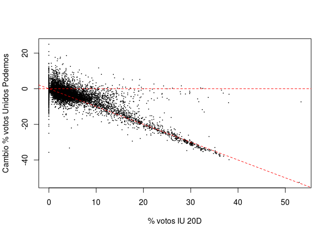
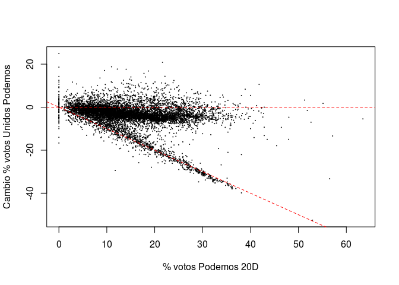
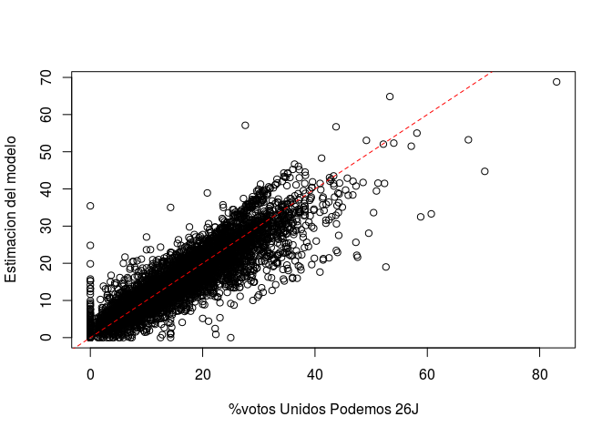

# Psefologia del Unidos Podemos en el 26J
David García  
1 Julio 2016  


<!-- -->

```
## 
## Call:
## lm(formula = percChange ~ percIU15, data = voteData)
## 
## Residuals:
##     Min      1Q  Median      3Q     Max 
## -36.124  -1.827  -0.404   1.484  35.615 
## 
## Coefficients:
##              Estimate Std. Error  t value Pr(>|t|)    
## (Intercept)  0.414010   0.057538    7.195  6.8e-13 ***
## percIU15    -0.813784   0.007493 -108.611  < 2e-16 ***
## ---
## Signif. codes:  0 '***' 0.001 '**' 0.01 '*' 0.05 '.' 0.1 ' ' 1
## 
## Residual standard error: 3.871 on 7899 degrees of freedom
## Multiple R-squared:  0.5989,	Adjusted R-squared:  0.5989 
## F-statistic: 1.18e+04 on 1 and 7899 DF,  p-value: < 2.2e-16
```


<!-- -->

```
## 
## Call:
## lm(formula = percChange ~ percP15, data = voteData)
## 
## Residuals:
##     Min      1Q  Median      3Q     Max 
## -38.652  -1.336   0.589   2.539  26.563 
## 
## Coefficients:
##              Estimate Std. Error t value Pr(>|t|)    
## (Intercept) -0.012731   0.132674  -0.096    0.924    
## percP15     -0.262282   0.008304 -31.586   <2e-16 ***
## ---
## Signif. codes:  0 '***' 0.001 '**' 0.01 '*' 0.05 '.' 0.1 ' ' 1
## 
## Residual standard error: 5.76 on 7899 degrees of freedom
## Multiple R-squared:  0.1121,	Adjusted R-squared:  0.112 
## F-statistic: 997.7 on 1 and 7899 DF,  p-value: < 2.2e-16
```

<!-- -->

```
## 
## Call:
## lm(formula = percUP16 ~ percP15 + percIU15 - 1, data = voteData)
## 
## Residuals:
##     Min      1Q  Median      3Q     Max 
## -35.443  -1.501   0.000   1.810  33.625 
## 
## Coefficients:
##          Estimate Std. Error t value Pr(>|t|)    
## percP15  0.992512   0.003789  261.92   <2e-16 ***
## percIU15 0.232232   0.007884   29.45   <2e-16 ***
## ---
## Signif. codes:  0 '***' 0.001 '**' 0.01 '*' 0.05 '.' 0.1 ' ' 1
## 
## Residual standard error: 3.883 on 7899 degrees of freedom
## Multiple R-squared:  0.9512,	Adjusted R-squared:  0.9512 
## F-statistic: 7.698e+04 on 2 and 7899 DF,  p-value: < 2.2e-16
```


